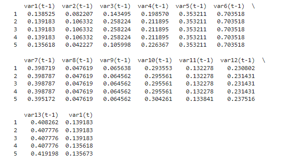
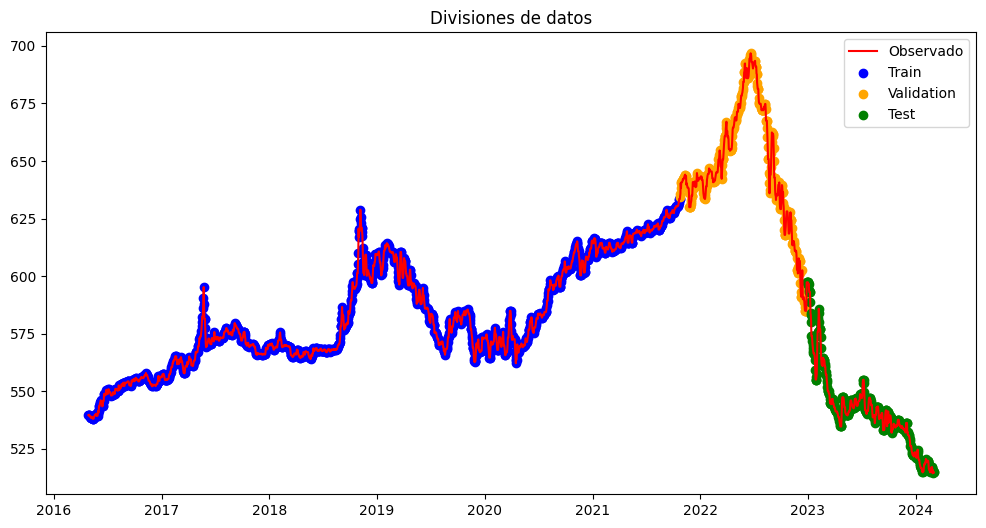
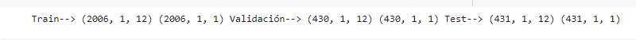
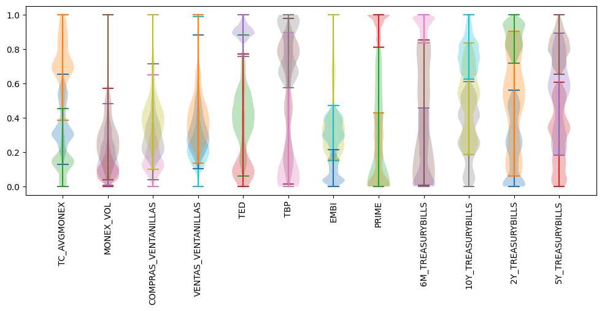
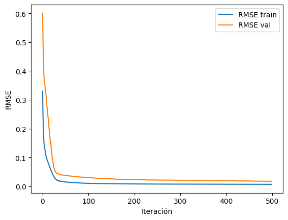
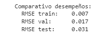
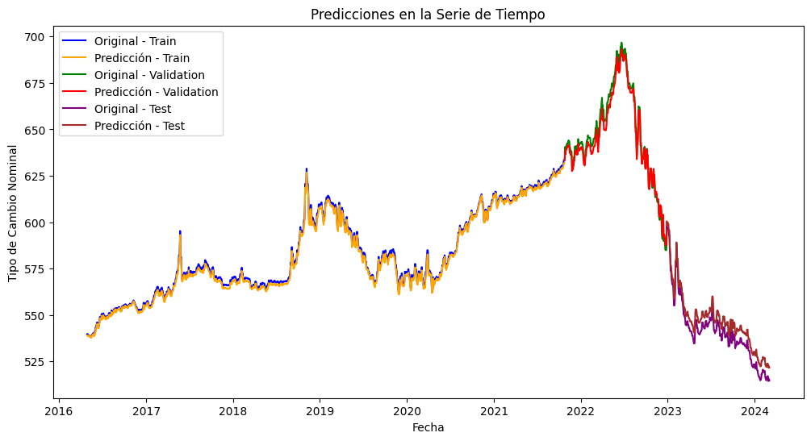

# Building the Model

1. **Load model data and double-check format**

2. **Normalize features**

   MinMaxScaler from scikit-learn is used to scale the features to the range (0, 1). Normalization is important to ensure that all features have the same scale and facilitate model training.

3. **Transform to supervised learning**

   The series_to_supervised function is used to convert the time series into a supervised learning problem. The first parameter is the scaled dataset, the second is the number of time steps for input observations (n_lags), and the third is the number of time steps for output observations (1). This was defined at the beginning of this section.

   * n_lag = 1: Here, we are defining the number of time periods (days in this case) to be used as lag in creating the sequences. In this case, it has been set to 1 day, meaning that the values of the last 1 day will be used as input to predict the next day.

   * n_features = dataset.shape[1]: This calculates the number of features (columns) in your original dataset (dataset). dataset.shape[1] returns the number of columns in the DataFrame, which corresponds to the number of features.

   * reframed = series_to_supervised(scaled, n_lag, 1): Here, a function called series_to_supervised is used to transform the time series into a supervised learning problem. The function takes three arguments:

   

4. **Drop columns we do not want to predict.**

5. **Train, validation, and test set split**

   - Train: 70% of the data
   - Validation: 15%
   - Test: 15%

   

6. **Reshape training, validation, and test sets for multivariate problem**

   

   Graphical distribution of data in train, validation, and test sets

   

7. **Model creation**

   - **Loss function**: RMSE
   - **Activation function**: linear --> It was found that for forecasting (regression), it is common to use this activation function

   ```python
   from tensorflow.keras.models import Sequential
   from tensorflow.keras.layers import LSTM, Dense
   from tensorflow.keras.optimizers import RMSprop, Adam
   import tensorflow as tf

   tf.random.set_seed(123)
   tf.config.experimental.enable_op_determinism()

   N_UNITS = 128 # Size of hidden state (h) and memory cell (c) (128)
   INPUT_SHAPE = (X_train.shape[1], X_train.shape[2]) # (rows/dates) x 12 (features)

   # Hyperparameters

   learn_rate = 0.0005  # 5e-4 before
   EPOCHS = 500 # Hyperparameter
   BATCH_SIZE = 256 # Hyperparameter

   model = Sequential()

   model.add(LSTM(N_UNITS, input_shape=INPUT_SHAPE))

   model.add(Dense(OUTPUT_LENGTH, activation='linear')) # activation = 'linear' because we want to predict (regression)

   # Loss function
   def root_mean_squared_error(y_true, y_pred):
       rmse = tf.math.sqrt(tf.math.reduce_mean(tf.square(y_pred-y_true)))
       return rmse

   # Compilation
   optimizer = RMSprop(learning_rate= learn_rate)
   model.compile(
       optimizer = optimizer,
       loss = root_mean_squared_error,
   )


## Training


8. Evaluation

   We use 500 epochs and see that from around 50 the error drops and converges to zero.

   

   The model scores look quite good. The fit is good, and although it increases in the test period, it does not do so drastically. Although it can certainly be improved, it's not bad.

   

   Finally, after rescaling the data (returning to our original magnitude), we can evaluate the forecasts vs the observed time series in reality.

   

   Not bad for a first experiment!

