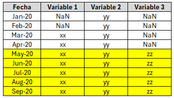
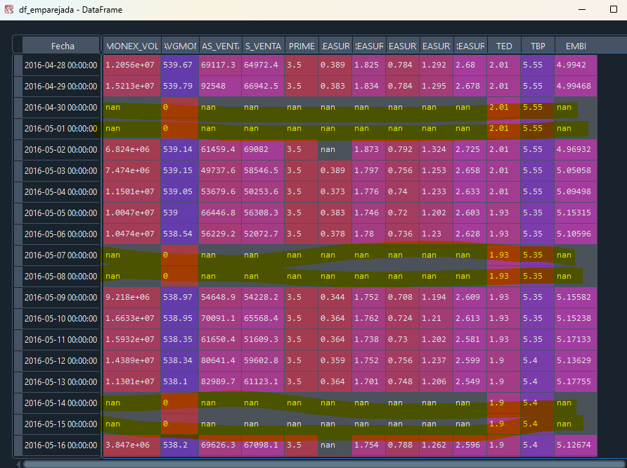

# Data

The variables used were selected according to the following criteria:

1. Short-term variables that motivate the preference for buying or selling dollars by both the public and the Non-Banking Public Sector (e.g., pension funds).
2. Daily frequency to have a larger volume of data and because of having a forecasting horizon of less than 1 year.

Observations:

* The **data selection can be improved**, for example, by using existing economic literature. As the scope of the project is about the use of ML techniques, no time was invested in literature reviews.
* For the purposes of this work, although variables were selected with certain economic rationale, the **priority is to look for patterns in the very short-term decisions** of the agents. This makes variables related to fundamental factors (e.g., imports, exports, tourism, FDI, etc.) not so relevant for the considered time horizon.
* In addition to the previous point, **fundamental variables were discarded due to their frequency and lag** in publication --> A fundamental challenge in the discipline that has led to the emergence of initiatives such as nowcasting with real-time Google data, satellite data with parking lots of shopping centers, electricity consumption data, etc.

## Variable Dictionary

| Variable              | Description                                  | Source     |
|-----------------------|----------------------------------------------|------------|
| MONEX_VOL             | Volume traded in MONEX                             | BCCR  |
| TC_AVGMONEX           | Average exchange rate MONEX                |  BCCR   |
| COMPRAS_VENTANILLAS   | Dollar purchases at teller windows                       | BCCR  |
| VENTAS_VENTANILLAS    | Dollar sales at teller windows                        | BCCR  |
| PRIME                 | US Prime Rate                                        | BCCR  |
| 6M_TREASURYBILLS     | 6-month Treasury Bills                  | BCCR  |
| 10Y_TREASURYBILLS    | 10-year Treasury Bills                  | BCCR   |
| 2Y_TREASURYBILLS     | 2-year Treasury Bills                   |  BCCR   |
| 5Y_TREASURYBILLS     | 5-year Treasury Bills                   |  BCCR   |
| 30Y_TREASURYBILLS    | 30-year Treasury Bills                  | BCCR  |
| TED                   | Effective Dollar Rate                                          | BCCR |
| TBP                   | Passive Basic Rate                                          | BCCR  |
| EMBI                  | Emerging Markets Bond Index (risk premium vs US)                                         | Bloomberg |

## Cleaning

1. The database corresponds to several time series in which there are more data available for some compared to others --> this requires "matching" the series in order to process them as matrices.

2. Since the exchange rate is not traded during weekends and holidays, there will be NaNs. Also, due to the way the BCCR reports the exchange rate, there may be NaNs or 0's. Here, these NaNs could be either removed or filled with the data from the previous day. In this case, to avoid losing observations, they will be kept with data from the previous day. Moreover, it is reasonable to do this since the exchange rate over the weekend at teller windows remains the last available rate.

