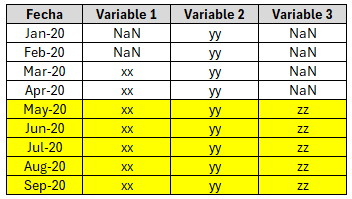
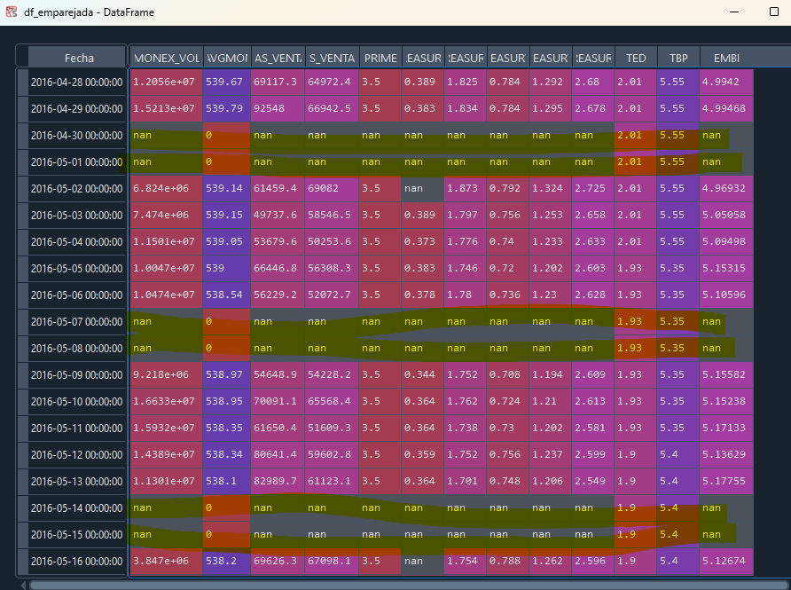

# ML_Final_Project
This repo houses my final project for a machine learning course at TEC de Costa Rica. Titled 'Time Series Forecasting with LSTM Model' it showcases how to solve a forecasting problem for time series with recurrent neural networks. Although time-constrained, it offers a primer for more sophisticated models. This is joint work with Cristian Cubero.

# Table of Contents

- [1. What is LSTM](<# 1. What is LSTM>): high level explanation and examples.
- [2. Preprocessing](<# 2. Pre-processing>): handling missing values and building a rectangular matrix for next steps.
- [3. Time series to supervised learning problem](<Documentation/3. Time series to supervised learning problem.md>): transform lags into features.
- [4. Building the model](<Documentation/4. Building the model.md>): get the data ready, split into train, val and test, build the model, train it and see what happens.
- [5- Results and final remarks](<Documentation/5. Results and final remarks.md>): couple lessons from this flash project.

# 1. What is LSTM

## Neural Network
* Network composed of nodes called neurons that work together to learn patterns.
* Each neuron processes information and passes its result to the following ones, forming layers.
* The network "learns" by adjusting the weights between connections to improve accuracy in its predictions (Goodfellow et al., 2016).

* 

* **Example**: Passing a regular NN the letter sequence: 'L I G A' and then 'C A M P E Ó N'.
  * When processing the second sequence 'CAMPEÓN', it already forgot about 'LIGA'.
  * Even when processing the letter 'I' in the first sequence, it already forgot about 'L'.
  * That's a problem because no matter how much it's trained, it will always find it difficult to guess the next most probable sequence: 'CAMPEÓN'.
  * This makes it a rather poor candidate for certain tasks, such as speech recognition, which benefit from the ability to predict what will come next.
  * **Conclusion**: Regular NNs have no memory, and although they serve for certain tasks, if memory is important, they will have poor results.

## Recurrent Neural Network (RNN)

* NN that has feedback connections that allow it to remember previous information. It's useful for processing data sequences, such as text or time series (Cho et al., 2014).
* 

* **Example**: Passing an RNN the letter sequence: 'S A P R I S S A' and then 'C A M P E Ó N'.

  * The unit, or artificial neuron, of the RNN, upon receiving the sequence 'CAMPEÓN', also takes as input the sequence it received a moment ago 'SAPRISSA'.
  * It adds the immediate past to the present.
  * This gives it the advantage of a limited short-term memory that, along with its training, provides enough context to guess which is more likely to be the next sequence: 'CAMPEÓN'.
  * **Colloquial Conclusion**: Regular RNNs have memory, and that gives them a boost to predict what's coming.

## What kinds of problems benefit from having memory?

Some examples include: 1. **Time Series Prediction**, 2. Natural Language Processing (NLP) 3. Speech Recognition, 4. Long-term Strategy Games, 5. Sentiment Analysis Over Time, 6. Medicine and Health, 7. Autonomous Robotics, 8. Predictive Maintenance

# Long Short-Term Memory (LSTM)

LSTM is a variant of RNN designed to overcome the problem of short-term forgetting.

1. **Memory Cell:**
   - Acts as a long-term memory, remembering or forgetting information based on received signals.

2. **Gates:**
   - **Forget Gate:** Decides which information from the memory cell should be discarded.
   - **Input Gate:** Determines what new information should be added to the memory cell.
   - **Output Gate:** Filters the output information based on the memory cell.

3. **Memory Cell Update:**
   - The memory cell is updated by multiplying the current information by the forget gate and adding the new information multiplied by the input gate.

4. **Output:**
   - The output is filtered using the output gate based on the updated memory cell.

**LSTM Parameters:**
- Weights and biases associated with forget, input, and output gates.
- Activation functions, commonly the sigmoid and hyperbolic tangent functions.

Visual representation:

* Utilizes 2 pathways (long and short-term) instead of just 1 like an RNN - after "a corto plazo" at the beginning of lstm.

* The sigmoid function takes a coordinate on the x-axis and converts it to any coordinate on the y-axis between 0 and 1 (giving us the forget gate, the percentage of long-term memory to be discarded).

* The tanh function takes a coordinate on the x-axis and converts it to any coordinate on the y-axis between (-1, 1). When combined with different weights, it gives us the potential long-term memory and short-term memory.

# 2. Pre-processing

The variables used were selected according to the following criteria:

1. Short-term variables that motivate the preference for buying or selling dollars by both the public and the Non-Banking Public Sector (e.g., pension funds).
2. Daily frequency to have a larger volume of data and because of having a forecasting horizon of less than 1 year.

Observations:

* The **data selection can be improved**, for example, by using existing economic literature. As the scope of the project is about the use of ML techniques, no time was invested in literature reviews.
* For the purposes of this work, although variables were selected with certain economic rationale, the **priority is to look for patterns in the very short-term decisions** of the agents. This makes variables related to fundamental factors (e.g., imports, exports, tourism, FDI, etc.) not so relevant for the considered time horizon.
* In addition to the previous point, **fundamental variables were discarded due to their frequency and lag** in publication --> A fundamental challenge in the discipline that has led to the emergence of initiatives such as nowcasting with real-time Google data, satellite data with parking lots of shopping centers, electricity consumption data, etc.

## Variable Dictionary

| Variable              | Description                                  | Source     |
|-----------------------|----------------------------------------------|------------|
| MONEX_VOL             | Volume traded in MONEX                             | BCCR  |
| TC_AVGMONEX           | Average exchange rate MONEX                |  BCCR   |
| COMPRAS_VENTANILLAS   | Dollar purchases at teller windows                       | BCCR  |
| VENTAS_VENTANILLAS    | Dollar sales at teller windows                        | BCCR  |
| PRIME                 | US Prime Rate                                        | BCCR  |
| 6M_TREASURYBILLS     | 6-month Treasury Bills                  | BCCR  |
| 10Y_TREASURYBILLS    | 10-year Treasury Bills                  | BCCR   |
| 2Y_TREASURYBILLS     | 2-year Treasury Bills                   |  BCCR   |
| 5Y_TREASURYBILLS     | 5-year Treasury Bills                   |  BCCR   |
| 30Y_TREASURYBILLS    | 30-year Treasury Bills                  | BCCR  |
| TED                   | Effective Dollar Rate                                          | BCCR |
| TBP                   | Passive Basic Rate                                          | BCCR  |
| EMBI                  | Emerging Markets Bond Index (risk premium vs US)                                         | Bloomberg |

## Cleaning

1. The database corresponds to several time series in which there are more data available for some compared to others --> this requires "matching" the series in order to process them as matrices.

2. Since the exchange rate is not traded during weekends and holidays, there will be NaNs. Also, due to the way the BCCR reports the exchange rate, there may be NaNs or 0's. Here, these NaNs could be either removed or filled with the data from the previous day. In this case, to avoid losing observations, they will be kept with data from the previous day. Moreover, it is reasonable to do this since the exchange rate over the weekend at teller windows remains the last available rate.

# Resources
## Data

1. MONEX Daily Statistics, Central Bank of Costa Rica.
2. Foreing and Domestic Rates, Central Bank of Costa Rica.
3. CRI Emerging Markets Bond Index, JP Morgan/Bloomberg through Ivenomica.

## Practical Resources

1.   https://machinelearningmastery.com/multivariate-time-series-forecasting-lstms-keras/
2.   https://machinelearningmastery.com/convert-time-series-supervised-learning-problem-python/

3.  ["Time Series Prediction with LSTM Recurrent Neural Networks in Python with Keras" por Jason Brownlee](https://machinelearningmastery.com/time-series-prediction-lstm-recurrent-neural-networks-python-keras/)
4. ["Understanding LSTM Networks" por Christopher Olah](https://colah.github.io/posts/2015-08-Understanding-LSTMs/)
5. ["Deep Learning for Time Series Forecasting" por Jason Brownlee](https://machinelearningmastery.com/deep-learning-for-time-series-forecasting/)
6. ["Sequence to Sequence Learning with Neural Networks" por Ilya Sutskever, Oriol Vinyals, and Quoc V. Le (2014)](https://arxiv.org/abs/1409.3215)

## Bibliographic Resources

1. Goodfellow, I., Bengio, Y., Courville, A. (2016). Deep Learning. MIT Press.
2. Cho, K., Van Merriënboer, B., Gulcehre, C., Bahdanau, D., Bougares, F., Schwenk, H., & Bengio, Y. (2014). Learning Phrase Representations using RNN Encoder-Decoder for Statistical Machine Translation. arXiv preprint arXiv:1406.1078.
3. Hochreiter, S., & Schmidhuber, J. (1997). Long short-term memory. Neural computation, 9(8), 1735-1780.
4. Graves, A., Mohamed, A. R., & Hinton, G. (2013). Speech recognition with deep recurrent neural networks. In 2013 IEEE international conference on acoustics, speech and signal processing (pp. 6645-6649). IEEE.
